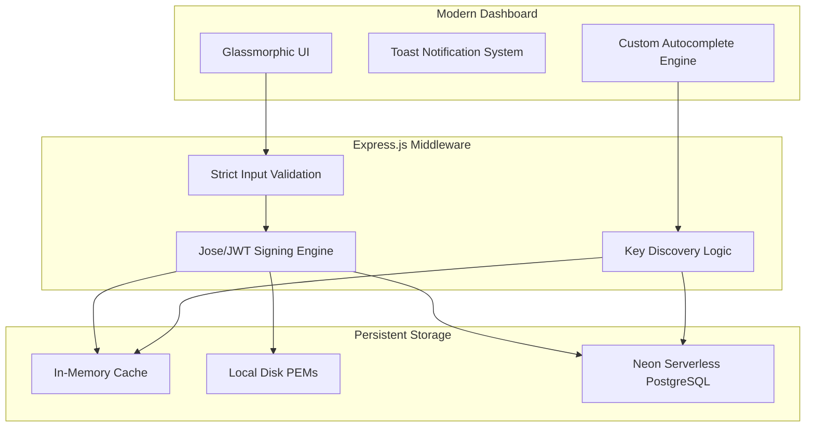

# 🛡️ Trust Broker

A robust, modern JWK (JSON Web Key) Auth Server and Token Management Dashboard. Trust Broker allows developers to generate secure RSA-256 key pairs, manage them via a serverless PostgreSQL backend, and issue signed JWTs with granular validation.

---

## 🏗️ Architecture & Design

Trust Broker is built on a resilient three-tier architecture designed for high availability and ease of use.

### Design Philosophy
The system follows a **"Secure by Default"** philosophy. Every token issued is validated for completeness (Key ID and Payload), and the UI provides immediate, non-blocking feedback through a custom glassmorphic toast system. 

### Component Diagram

---

## ⚡ Scaling with Neon Serverless DB

Trust Broker leverages **Neon PostgreSQL** to provide a truly serverless backend that scales effortlessly without manual intervention.

### Why Neon?
- **Autoscaling**: Neon's compute resources scale up automatically during token generation spikes and scale down to zero when the dashboard is idle, ensuring zero cost at rest.
- **Connection Pooling**: Neon optimizes connections through built-in pooling, allowing Trust Broker to handle thousands of concurrent key lookups without hitting database connection limits.
- **Performance Preservation**: Unlike traditional DBs where scaling can introduce latency, Neon's separation of storage and compute ensures that key retrieval remains fast regardless of database size.
- **Resilient Fallbacks**: Trust Broker is architected to utilize local disk-based demo keys if the database connection is ever interrupted, guaranteeing high availability for critical signing tasks.

---

## 🚀 Usage Guide

### 1. Key Generation
In the **Key Generator** card:
- Enter a unique **Key ID (kid)**.
- Select an **Expiration Time** (15m to 2h) using the themed dropdown.
- Provide an **Audience (aud)**.
- Click **Create & Save**. The key pair will be generated on the server and stored in the Neon database.

### 2. Key Exploration
In the **Key Explorer** card:
- Use the **Autocomplete** search field. Suggestions will appear after typing 5 characters.
- Click **Lookup** or select a suggestion to view the public JWK (JSON Web Key).

### 3. Token Issuance
In the **Token Issuer** card:
- Select the **Key ID** you wish to sign with.
- Provide a valid **JSON Payload** (e.g., `{"sub": "user_123", "role": "admin"}`).
- Click **Generate Signed JWT**. The server will sign the payload using the private key associated with your `kid`.

---

## 🛠️ API Reference

### Key Discovery
#### `GET /keys/list`
Returns a unique list of all available Key IDs from both memory and the database. Used for the dashboard autocomplete.
- **Response**: `["demo-key-1", "user-prod-key", ...]`

### Public Key Lookup
#### `GET /.well-known/jwk?id=<kid>`
Retrieves the public JWK for a specific key.
- **Parameters**: `id` (string, required)
- **Response**: Standard JWK object.

### Token Generation
#### `POST /issue-token`
Issues a signed RS256 JWT.
- **Headers**: `x-key-id`: The Key ID to sign with.
- **Body**: `{ "payload": { ... } }`
- **Response**: `{ "token": "...", "kid": "..." }`

### Key Management
#### `POST /keys`
Generates and persists a new RSA key pair.
- **Body**: `{ "kid": "...", "expiration_time": "...", "audience": "..." }`
- **Response**: Confirmation of creation and public metadata.

---

## 📦 Installation

1. Clone the repository.
2. Install dependencies: `npm install`
3. Configure your `.env` with `DATABASE_URL` from Neon.
4. Start the server: `npm run dev`
